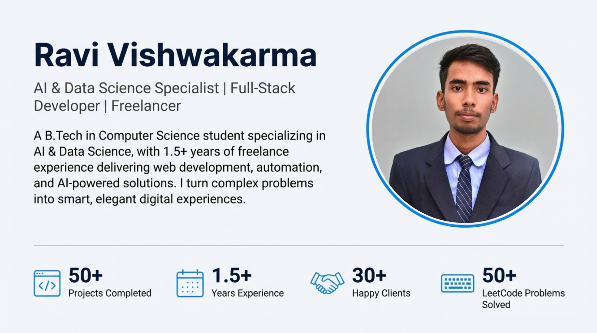

# 🚀 AI & Data Science Portfolio — Ravi Kumar Vishwakarma

<div align="center">

[](https://profileravi.netlify.app)
[](https://opensource.org/licenses/MIT)
[](https://developer.mozilla.org/en-US/docs/Web/HTML)
[](https://developer.mozilla.org/en-US/docs/Web/JavaScript)
[](https://profileravi.netlify.app)

**A data-driven personal portfolio showcasing expertise in Data Science, AI Engineering & Web Development.**

🔗 **Live Demo (Netlify):** [profileravi.netlify.app](https://profileravi.netlify.app)  
🔗 **Live Demo (Vercel):** [profileravi.vercel.app](https://profileravi.vercel.app)

</div>

---

## 📌 Overview

Traditional resumes and static portfolios often fall short of demonstrating a Data Scientist's real-world capabilities. This project solves that by providing a **fully dynamic, data-driven portfolio** that is easy to maintain, visually compelling, and lightning fast — even on mobile.

---

## 🧩 The Problem

| Pain Point | Description |
|---|---|
| **Information Overload** | Managing certificates, projects, and skills without cluttering the UI |
| **Maintenance Complexity** | Updating content usually requires editing deeply nested HTML |
| **Performance Issues** | Rendering high-quality visuals and animations on low-end mobile devices |

---

## 💡 The Solution

This portfolio adopts a **Decoupled Architecture** to address each challenge:

- **JSON-Driven Content** — All dynamic data (projects, skills, experience, education) lives in modular JSON files. Content updates never touch UI logic.
- **Async Rendering** — JavaScript fetches and renders data dynamically, keeping load times minimal and the experience smooth.
- **Modern UI/UX** — Dark-themed glassmorphic design with animated SVG patterns to reflect a high-tech AI aesthetic.

---

## 🛠️ Tech Stack

| Layer | Technology |
|---|---|
| Frontend | HTML5, CSS3 (Grid & Flexbox), JavaScript ES6+ |
| Data Layer | JSON (Modular Architecture) |
| Animations | CSS Keyframes & SVG Animations |
| Deployment | Netlify + Vercel with GitHub Actions CI/CD |
| SEO | `robots.txt` + `sitemap.xml` |
| Typography | Orbitron (headings) & Poppins (body) |

---

## 📁 Project Structure

```bash
profileravi/
├── index.html                        # Main entry point
├── robots.txt                        # SEO crawler directives
├── sitemap.xml                       # SEO sitemap for indexing
│
├── assets/
│   ├── css/
│   │   ├── style1.css                # Core layout & theme styles
│   │   └── style2.css                # Component-level styles
│   │
│   ├── data/                         # 📦 JSON data layer (edit content here)
│   │   ├── activities.json           # Extracurricular & community activities
│   │   ├── certificates.json         # Certifications & credentials
│   │   ├── education.json            # Academic background
│   │   ├── experience.json           # Internships & work experience
│   │   ├── other.json                # Miscellaneous info
│   │   ├── projects.json             # Portfolio projects
│   │   ├── skills.json               # Technical skills
│   │   ├── soft.json                 # Soft skills
│   │   └── tools.json                # Tools & platforms
│   │
│   ├── document/
│   │   └── Ravi Vishwakarma _ Data Scientist Intern _ Resume.pdf
│   │
│   ├── img/                          # Optimized images & project thumbnails
│   │   ├── aks.webp
│   │   ├── bg.gif
│   │   ├── cert.webp
│   │   ├── cert1.webp
│   │   ├── cert2.webp
│   │   ├── cert3.webp
│   │   ├── pm.webp
│   │   ├── project1.jpg
│   │   ├── project2.jpg
│   │   ├── project3.jpg
│   │   ├── project4.jpg
│   │   ├── project5.webp
│   │   └── resume.jpg
│   │
│   └── js/
│       ├── script.js                 # Core logic: data fetching & rendering
│       └── transition.js             # Page transition animations
│
├── blog/
│   ├── blog.html                     # Blog listing page
│   └── blog_og/
│       └── blog.webp                 # Open Graph image for blog
│
├── og/
│   ├── img.webp                      # General Open Graph image
│   └── og.webp                       # Social preview image
│
└── resume/
    └── resume.html                   # Standalone resume view page
```

---

## 🚧 Challenges & How I Solved Them

### 1. Data Integrity
**Problem:** Ensuring all JSON files load correctly and map accurately to their UI components.  
**Solution:** Implemented async/await fetch wrappers with error boundaries to catch and log malformed or missing data gracefully.

### 2. Responsive Typography
**Problem:** Balancing *Orbitron* (display) and *Poppins* (body) fonts across all screen sizes.  
**Solution:** Used CSS `clamp()` for fluid type scaling and media queries for layout breakpoints.

### 3. CI/CD Pipeline
**Problem:** Manual deployments were error-prone and slow.  
**Solution:** Configured GitHub Actions (`static.yml`) for automated deployment to Netlify on every push to `main`.

---

## ⚙️ How to Update Content

All portfolio content is stored in `assets/data/`. To update your portfolio, simply edit the relevant JSON file — no HTML changes required.

| File | What to edit |
|---|---|
| `projects.json` | Add/remove/update projects |
| `experience.json` | Update internships or jobs |
| `certificates.json` | Add new certifications |
| `skills.json` | Modify technical skills |
| `education.json` | Update academic info |

---

## 🚀 Running Locally

```bash
# Clone the repository
git clone https://github.com/your-username/profileravi.git

# Navigate into the project
cd profileravi

# Open in browser (no build step required)
# Simply open index.html in your browser, or use Live Server in VS Code
```

> **Note:** Because the project uses `fetch()` to load JSON files, you'll need a local server (like VS Code Live Server or `npx serve`) rather than opening `index.html` directly via `file://`.

---

## 🌐 Deployment

The project is deployed on **two platforms** for redundancy:

| Platform | URL | Trigger |
|---|---|---|
| Netlify | [profileravi.netlify.app](https://profileravi.netlify.app) | Auto-deploy on `git push` |
| Vercel | [profileravi.vercel.app](https://profileravi.vercel.app) | Auto-deploy on `git push` |

CI/CD is powered by **GitHub Actions** with a `static.yml` workflow.

---

## 📸 Preview

> _Add a screenshot or GIF of your portfolio here for maximum impact._

```markdown

```

---

## 📄 License

This project is licensed under the [MIT License](https://opensource.org/licenses/MIT).  
Feel free to fork, customize, and use it as a base for your own portfolio — a credit is appreciated but not required.

---

## 🙋‍♂️ Author

**Ravi Kumar Vishwakarma**  
B.Tech CSE (AI & Data Science) | AKS University, Satna, MP  
📧 Connect via [LinkedIn](https://linkedin.com) · [GitHub](https://github.com)

---

<div align="center">
  <sub>Built with ❤️ and lots of JSON by Ravi Kumar Vishwakarma</sub>
</div>
